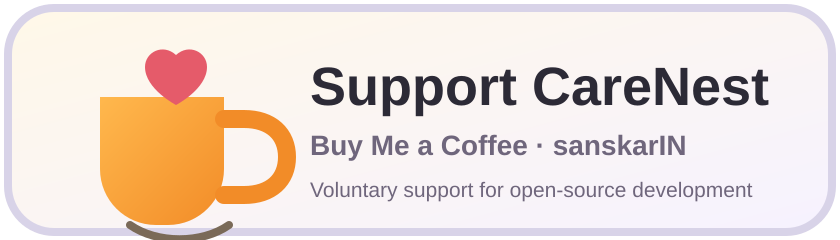

# CareNest

> **Current authoritative automated baseline — 2026-08-15:** marker-only PR #59 verified source/base `8489d19734d6142054156d5b57f2713195c16b65` with **310/310 core tests** (122 unit + 39 integration + 149 UI-contract/policy), all four default Release builds, all four `CareNestShowFundingLink=false` store-safe Release builds, CodeQL #622 / `31869214042`, and unsuppressed Dependency Audit #44 / `31869214093` successful. Store Package Configuration #11 / `31869214047` is also green. PR #59 was closed without merge; its marker is not part of `main`. PR #58, PR #56, and PR #54 remain historical exact-source evidence for their frozen boundaries. See [`docs/releases/STORE_SAFE_CONFIGURATION_VERIFICATION_20260815.md`](docs/releases/STORE_SAFE_CONFIGURATION_VERIFICATION_20260815.md) and [`docs/COMPLETE_PROJECT_DOCUMENTATION.md`](docs/COMPLETE_PROJECT_DOCUMENTATION.md).

CareNest is an open-source, local-first health organizer built with .NET MAUI and C#. It helps people organize medicine reminders, appointments, health documents, stock/refill notes, reports, backups, and multiple local family profiles without requiring a CareNest account or CareNest network service.

[](https://buymeacoffee.com/sanskarIN)

> **Medical limitation:** CareNest is an organizational tool. It does not diagnose conditions, determine or infer dosage, recommend treatment, perform clinical medication-interaction checking, create clinical risk scores, verify adherence, replace a clinician/pharmacist, or provide emergency services. Follow instructions from qualified professionals. In an emergency, use the appropriate local emergency service rather than relying on this app.

## Current source status

CareNest is currently tracked as:

`1.0.0-rc.1`

The earlier README statement that PR #43 was a fully green automated baseline was incorrect. GitHub Actions records show that PR #43 passed formatting, platform builds, CodeQL, and Dependency Audit, but its core CI failed during integration testing and the UI-contract suite was skipped. PR #43 is therefore **not** release evidence.

The defects exposed by the continuing 2026-08-14 audit were corrected on `main`, including reminder effective-due/stale-request reconciliation, platform cancellation/compensation, appointment persistence compensation, cancellation-first reminder actions, report-cache cleanup, analyzer corrections, and SQLite native/provider dependency remediation.

The authoritative final automated **runtime bug-audit** baseline remains marker-only PR #54, closed without merge after all required gates succeeded:

- CareNest CI #503 / run `31766059137`: success;
- formatting: success;
- unit tests: 122 passed;
- integration tests: 39 passed;
- UI-contract/policy tests: 100 passed;
- total automated tests: 261 passed;
- Android Release: success;
- Windows Release: success;
- iOS simulator Release: success;
- Mac Catalyst Release: success;
- CodeQL #503 / run `31766059215`: success;
- unsuppressed Dependency Audit #35 / run `31766059132`: success.

PR #53 independently completed a duplicate green verification of the same final runtime/test graph, but PR #54 is the recorded authoritative runtime bug-audit checkpoint. Later release-engineering source was verified by PR #56, package/store-policy hardening by PR #58, and the current default-plus-store-safe source boundary by PR #59 as stated at the top of this README. Verification marker files from these PRs are not part of `main`.

See:

- [`docs/COMPLETE_PROJECT_DOCUMENTATION.md`](docs/COMPLETE_PROJECT_DOCUMENTATION.md)
- [`PROJECT_STATUS.md`](PROJECT_STATUS.md)
- [`what_changed.md`](what_changed.md)
- [`docs/releases/STORE_SAFE_CONFIGURATION_VERIFICATION_20260815.md`](docs/releases/STORE_SAFE_CONFIGURATION_VERIFICATION_20260815.md)
- [`docs/releases/PACKAGED_RELEASE_HARDENING_VERIFICATION_20260815.md`](docs/releases/PACKAGED_RELEASE_HARDENING_VERIFICATION_20260815.md)
- [`docs/releases/STORE_POLICY_REVIEW_20260815.md`](docs/releases/STORE_POLICY_REVIEW_20260815.md)
- [`docs/releases/RELEASE_ENGINEERING_VERIFICATION_20260814.md`](docs/releases/RELEASE_ENGINEERING_VERIFICATION_20260814.md)
- [`docs/releases/FINAL_BUG_AUDIT_VERIFICATION_20260814.md`](docs/releases/FINAL_BUG_AUDIT_VERIFICATION_20260814.md)
- [`docs/releases/BUG_AUDIT_VERIFICATION_20260814.md`](docs/releases/BUG_AUDIT_VERIFICATION_20260814.md)
- [`docs/testing/BUG_AUDIT_REGRESSION_MATRIX_20260814.md`](docs/testing/BUG_AUDIT_REGRESSION_MATRIX_20260814.md)
- [`docs/security/BUG_AUDIT_SECURITY_NOTES_20260814.md`](docs/security/BUG_AUDIT_SECURITY_NOTES_20260814.md)

The previously tracked SQLite native dependency exception has been remediated in the verified source graph: maintained native/provider leaves are centrally pinned, the exact NuGet audit suppression has been removed, the dependency contract prevents the old dependency/suppression baseline from silently returning, and the current source passed unsuppressed Dependency Audit. Final production promotion still requires the normal manual existing-database/backup/device compatibility checks.

## Highlights

- Local-first SQLite records; no CareNest account/server required.
- Multiple local profiles with optional app lock.
- User-defined medicine schedules without dosage inference.
- Reminder lifecycle including scheduled, snoozed, taken, skipped, delayed, missed, and cancelled states.
- Deterministic reminder planning with explicit entity ownership, UTC-window, date/state and DST boundaries.
- Invalid DST-gap times are not replaced with guessed reminder clock times.
- `EveryNHours` invalid DST-gap anchors now fail closed instead of being silently shifted.
- Archived profiles and inactive medicines do not automatically materialize reminders.
- Snooze timestamps must be explicit future UTC values.
- Snoozed rows use snooze due time for upcoming/overdue handling.
- Rebuild explicitly reconciles SQLite reminder rows with existing operating-system scheduled requests.
- Reminder actions cancel the old platform request before committing handled state and attempt non-cancelled restoration if later persistence/scheduling fails.
- Medicine/profile delete flows cancel future platform requests before database cascade and compensate if the cascade fails.
- Medicine/profile save flows reconcile platform reminders before non-critical audit bookkeeping can fail the operation.
- Appointment reminder persistence is compensated so database/platform state can be reconciled when later steps fail.
- Appointment `StartsUtc` requires explicit UTC; local/unspecified ticks are not silently relabeled.
- Appointment rebuild does not repeatedly prompt for notification permission.
- Encrypted local document vault with failure-compensating import behavior.
- Missing/corrupt document master key plus existing encrypted payload fails closed instead of silently creating a replacement key.
- Decrypted temporary document exports use the managed `Exports` cache directory.
- Shared report-cache files are removed after successful external sharing where the application still owns the temporary copy.
- New encrypted document/backup payloads use authenticated chunked AEAD framing v2; legacy v1 remains readable for compatibility.
- Strict decrypted-backup archive topology validation before extraction.
- Backup completion is distinguished from later best-effort local bookkeeping.
- Sensitive application-owned verifier/key/salt/crypto buffers are cleared where managed-memory control permits.
- Stock/refill tracking based only on user-entered quantities.
- Per-profile JSON export plus PDF/CSV reports with privacy and clinical-limit warnings.
- CSV formula-like user text is neutralized in the portable spreadsheet representation.
- CSV/PDF/JSON writers use partial-file staging plus atomic final move.
- Manual password-encrypted backup/restore, including portable recovery of locally encrypted documents.
- Light, dark, system theme and accessibility-ready layouts.
- Android, iOS, Mac Catalyst, and Windows targets.
- Privacy-aware developer diagnostics and exception-log redaction contracts.
- Transactional multi-step SQLite operations and schema migrations.
- Failure-safe onboarding/app-lock/profile-photo workflows.
- Android `BroadcastReceiver.GoAsync()` recovery lifetime protection.
- Windows in-process reminder fallback protected against replacement/cancellation/disposal timer races.
- Independent startup recovery boundaries for medicine, appointment and backup reminder recovery.
- Build-configurable voluntary project-support surface; store-safe builds can force `CareNestShowFundingLink=false` without changing health-organizer behavior.
- Dedicated multi-platform store-safe CI compiles Android, Windows, iOS simulator, and Mac Catalyst with the external funding surface disabled.
- Fail-closed Bash/PowerShell store-package preflight wrappers force the funding surface off for an explicit supported target and delegate the standard release preflight.
- Automated formatting, architecture, repository-policy, data-model, ViewModel, branding, async-safety, logging-privacy, app-lock, reminder-integrity, direct-service, backup-topology, authenticated-stream, recurrence, snapshot-integrity, report-export, transaction, dependency-security, platform-lifecycle, release-workflow, release-preflight, store-package-workflow/preflight, quality-gate, Git-setup, and production Release Gate contracts.

## Technology

- .NET 10 / .NET MAUI
- C# / XAML
- MVVM-style presentation separation
- SQLite (`sqlite-net-pcl`)
- built-in .NET cryptography for encrypted document/backup payloads
- xUnit
- GitHub Actions CI
- CodeQL
- Dependency Audit
- store-package configuration verification
- release-evidence/release-gate workflows

## Repository layout

```text
src/
  CareNest.App/
  CareNest.Domain/
  CareNest.Application/
  CareNest.Infrastructure/
  CareNest.Shared/
tests/
  CareNest.UnitTests/
  CareNest.IntegrationTests/
  CareNest.UiTests/
docs/
build/scripts/
.github/
```

## Documentation

The documentation hub is [`docs/README.md`](docs/README.md). The complete whole-project reference is [`docs/COMPLETE_PROJECT_DOCUMENTATION.md`](docs/COMPLETE_PROJECT_DOCUMENTATION.md).

Important current references:

- [`PROJECT_STATUS.md`](PROJECT_STATUS.md) — current automated baseline and real production blockers.
- [`what_changed.md`](what_changed.md) — complete active continuation handoff.
- [`docs/releases/STORE_SAFE_CONFIGURATION_VERIFICATION_20260815.md`](docs/releases/STORE_SAFE_CONFIGURATION_VERIFICATION_20260815.md) — authoritative PR #59 default-plus-store-safe exact-source evidence.
- [`docs/releases/PACKAGED_RELEASE_HARDENING_VERIFICATION_20260815.md`](docs/releases/PACKAGED_RELEASE_HARDENING_VERIFICATION_20260815.md) — historical PR #58 packaged-release hardening evidence.
- [`docs/releases/STORE_POLICY_REVIEW_20260815.md`](docs/releases/STORE_POLICY_REVIEW_20260815.md) — current dated support-link policy review and conservative Apple/Google package decision.
- [`docs/releases/RELEASE_ENGINEERING_VERIFICATION_20260814.md`](docs/releases/RELEASE_ENGINEERING_VERIFICATION_20260814.md) — historical PR #56 release-engineering evidence.
- [`docs/releases/FINAL_BUG_AUDIT_VERIFICATION_20260814.md`](docs/releases/FINAL_BUG_AUDIT_VERIFICATION_20260814.md) — historical final PR #54 runtime bug-audit evidence.
- [`docs/releases/BUG_AUDIT_VERIFICATION_20260814.md`](docs/releases/BUG_AUDIT_VERIFICATION_20260814.md) — 2026-08-14 bug-audit evidence and corrections.
- [`docs/testing/BUG_AUDIT_REGRESSION_MATRIX_20260814.md`](docs/testing/BUG_AUDIT_REGRESSION_MATRIX_20260814.md) — defect-to-test map.
- [`docs/security/BUG_AUDIT_SECURITY_NOTES_20260814.md`](docs/security/BUG_AUDIT_SECURITY_NOTES_20260814.md) — security/privacy-relevant audit notes.
- [`docs/USER_GUIDE.md`](docs/USER_GUIDE.md) — complete user guide.
- [`docs/FEATURE_REFERENCE.md`](docs/FEATURE_REFERENCE.md) — feature-by-feature behavior/boundaries.
- [`docs/architecture/ARCHITECTURE.md`](docs/architecture/ARCHITECTURE.md) — system architecture.
- [`docs/architecture/APPLICATION_FLOWS.md`](docs/architecture/APPLICATION_FLOWS.md) — runtime flows.
- [`docs/architecture/DATABASE_SCHEMA.md`](docs/architecture/DATABASE_SCHEMA.md) — schema/migrations/WAL model.
- [`docs/architecture/NOTIFICATIONS_AND_PLATFORM_BEHAVIOR.md`](docs/architecture/NOTIFICATIONS_AND_PLATFORM_BEHAVIOR.md) — platform notification behavior/limitations.
- [`docs/architecture/DOCUMENT_VAULT.md`](docs/architecture/DOCUMENT_VAULT.md) — encrypted document vault.
- [`docs/architecture/BACKUP_AND_RESTORE.md`](docs/architecture/BACKUP_AND_RESTORE.md) — encrypted backup/restore.
- [`docs/REPORTS_AND_EXPORTS.md`](docs/REPORTS_AND_EXPORTS.md) — report/export semantics.
- [`docs/privacy/PRIVACY_MODEL.md`](docs/privacy/PRIVACY_MODEL.md) — privacy architecture.
- [`docs/security/SECURITY_MODEL.md`](docs/security/SECURITY_MODEL.md) — security architecture.
- [`docs/security/THREAT_MODEL.md`](docs/security/THREAT_MODEL.md) — threats/controls/residual risk.
- [`docs/security/DEPENDENCY_RISK_REGISTER.md`](docs/security/DEPENDENCY_RISK_REGISTER.md) — dependency risk source of truth.
- [`docs/design/ACCESSIBILITY.md`](docs/design/ACCESSIBILITY.md) — accessibility specification/manual checks.
- [`docs/testing/TESTING_GUIDE.md`](docs/testing/TESTING_GUIDE.md) — automated/manual testing reference.
- [`docs/releases/STORE_BUILD_POLICY.md`](docs/releases/STORE_BUILD_POLICY.md) — store-safe build policy/workflow/preflight.
- [`docs/releases/PACKAGED_RELEASE_VALIDATION.md`](docs/releases/PACKAGED_RELEASE_VALIDATION.md) — packaged/manual evidence runbook.
- [`docs/releases/RELEASE_PROCESS.md`](docs/releases/RELEASE_PROCESS.md) — production release process.
- [`docs/releases/RELEASE_CHECKLIST.md`](docs/releases/RELEASE_CHECKLIST.md) — release gate checklist.
- [`docs/releases/NEXT_STEPS.md`](docs/releases/NEXT_STEPS.md) — current operational work.

## Quick start

See [`docs/setup/DEVELOPMENT.md`](docs/setup/DEVELOPMENT.md) and [`docs/setup/PLATFORM_SETUP.md`](docs/setup/PLATFORM_SETUP.md) for complete prerequisites and target-specific commands.

Platform-neutral build/test examples:

```bash
dotnet build src/CareNest.Shared/CareNest.Shared.csproj -c Release
dotnet build src/CareNest.Domain/CareNest.Domain.csproj -c Release
dotnet build src/CareNest.Application/CareNest.Application.csproj -c Release
dotnet build src/CareNest.Infrastructure/CareNest.Infrastructure.csproj -c Release
dotnet test tests/CareNest.UnitTests/CareNest.UnitTests.csproj -c Release
dotnet test tests/CareNest.IntegrationTests/CareNest.IntegrationTests.csproj -c Release
dotnet test tests/CareNest.UiTests/CareNest.UiTests.csproj -c Release
```

Android example on a machine provisioned for the Android MAUI workload:

```bash
dotnet workload install maui-android
dotnet build src/CareNest.App/CareNest.App.csproj \
  -f net10.0-android -c Release \
  -p:CareNestTargetFramework=net10.0-android
```

Store-safe Android preflight under the current conservative store decision:

```bash
CARENEST_TARGET=net10.0-android \
./build/scripts/store-package-preflight.sh
```

`CareNestTargetFramework` narrows the active multi-target MAUI framework before restore/build so a platform-specific machine does not have to evaluate unrelated target workloads and does not propagate the app target framework into the platform-neutral projects.

## Deterministic reminder scheduling

CareNest never chooses a medicine dose or infers how often a medicine should be used. Occurrences are generated only from explicit user-entered schedule values.

The scheduling contract is documented in [`docs/testing/REMINDER_SCHEDULING_CONTRACT.md`](docs/testing/REMINDER_SCHEDULING_CONTRACT.md).

Important invariants include:

- profile/medicine/schedule ownership validation;
- UTC planning windows;
- half-open planning boundaries;
- stable occurrence keys;
- duplicate-time deduplication;
- state/date limits;
- selected-weekday/cycle/every-N-hours rules;
- explicit future-UTC snoozes;
- DST gap/overlap handling;
- no invented replacement time for an invalid local clock time;
- reconciliation of stale platform requests after schedule/state/policy changes;
- cancellation-first handled-state transitions with compensation when a later step fails.

## Encrypted stream compatibility

New encrypted document/backup payloads use shared chunked AES-256-GCM framing version 2.

V2 authenticates terminal state so an authenticated chunk prefix cannot be accepted as a complete new stream merely because bytes end at a chunk boundary. Trailing data after the terminal is rejected.

Legacy framing version 1 remains readable for compatibility with existing CareNest data. Historical v1 ciphertext is not represented as retroactively upgraded.

## Privacy and security

Read:

- [`PRIVACY.md`](PRIVACY.md)
- [`SECURITY.md`](SECURITY.md)
- [`docs/privacy/PRIVACY_MODEL.md`](docs/privacy/PRIVACY_MODEL.md)
- [`docs/security/SECURITY_MODEL.md`](docs/security/SECURITY_MODEL.md)
- [`docs/security/THREAT_MODEL.md`](docs/security/THREAT_MODEL.md)
- [`docs/security/LOGGING_PRIVACY.md`](docs/security/LOGGING_PRIVACY.md)
- [`docs/security/DEPENDENCY_RISK_REGISTER.md`](docs/security/DEPENDENCY_RISK_REGISTER.md)
- [`docs/security/BUG_AUDIT_SECURITY_NOTES_20260814.md`](docs/security/BUG_AUDIT_SECURITY_NOTES_20260814.md)

The optional app lock is a local privacy barrier. It is not represented as transparent whole-SQLite-database encryption or a replacement for device security.

## SQLite dependency remediation

The previously tracked `GHSA-2m69-gcr7-jv3q` SQLite native dependency path is remediated in the verified source graph.

Current controls include:

- central transitive pinning of maintained SQLite native/provider leaves;
- removal of the exact advisory `NuGetAuditSuppress` entry;
- an automated dependency-security contract that rejects restoration of the old native/provider floor or audit suppression;
- successful unsuppressed Dependency Audit #44 / run `31869214093` on the authoritative PR #59 source;
- continued existing-database/backup/platform validation in the release checklist.

See:

- [`docs/security/DEPENDENCY_RISK_REGISTER.md`](docs/security/DEPENDENCY_RISK_REGISTER.md)
- [`docs/releases/SQLITE_DEPENDENCY_MIGRATION_PLAN.md`](docs/releases/SQLITE_DEPENDENCY_MIGRATION_PLAN.md)

This remediation does not change CareNest into a networked database product and does not intentionally change the SQLite schema, health-record semantics, encrypted-document format, or backup archive format.

## Release engineering

The current automated 2026-08-15 source baseline is fully green under PR #59. In addition to the normal/default four-platform Release configuration, PR #59 verified the funding-disabled store-safe Release configuration on Android, Windows, iOS simulator, and Mac Catalyst.

Automated source verification is necessary rather than sufficient for public production promotion. Still required include installed package/device/accessibility checks, packaged existing-database and encrypted-data compatibility checks, submission-time store-policy review, production signing/package work, store metadata, and final Release Evidence for the exact promoted commit/tag.

Production tags matching `v*` are configured to run the exact tagged commit through CareNest CI, CodeQL, Dependency Audit, CareNest Store Package Configuration, Release Gate, and CareNest Release Evidence. A tag is not production approval until every applicable automated and manual gate has completed successfully.

See:

- [`docs/releases/STORE_SAFE_CONFIGURATION_VERIFICATION_20260815.md`](docs/releases/STORE_SAFE_CONFIGURATION_VERIFICATION_20260815.md)
- [`docs/releases/STORE_BUILD_POLICY.md`](docs/releases/STORE_BUILD_POLICY.md)
- [`docs/releases/PACKAGED_RELEASE_VALIDATION.md`](docs/releases/PACKAGED_RELEASE_VALIDATION.md)
- [`docs/releases/RELEASE_ENGINEERING_VERIFICATION_20260814.md`](docs/releases/RELEASE_ENGINEERING_VERIFICATION_20260814.md)
- [`docs/releases/RELEASE_PROCESS.md`](docs/releases/RELEASE_PROCESS.md)
- [`docs/releases/RELEASE_CHECKLIST.md`](docs/releases/RELEASE_CHECKLIST.md)
- [`docs/releases/RELEASE_EVIDENCE.md`](docs/releases/RELEASE_EVIDENCE.md)
- [`docs/releases/SECURITY_RELEASE_REVIEW.md`](docs/releases/SECURITY_RELEASE_REVIEW.md)
- [`docs/releases/MANUAL_TEST_MATRIX.md`](docs/releases/MANUAL_TEST_MATRIX.md)
- [`docs/releases/STORE_SUBMISSION_CHECKLIST.md`](docs/releases/STORE_SUBMISSION_CHECKLIST.md)
- [`docs/releases/NEXT_STEPS.md`](docs/releases/NEXT_STEPS.md)

## ☕ Support CareNest

**[Buy Me a Coffee → https://buymeacoffee.com/sanskarIN](https://buymeacoffee.com/sanskarIN)**

If you want to voluntarily support CareNest, that support helps continued open-source design, testing, documentation, accessibility, platform maintenance, and future releases.

Project support does not unlock medical advice, premium health behavior, different reminder behavior, support priority, or access to user health data.

The default/open-source source configuration may display this support surface. Under the current 2026-08-15 conservative store review, initial Apple App Store and Google Play candidates should use `CareNestShowFundingLink=false` unless the submission-time store policy clearly permits the external link. Store-safe compilation is automated, but actual packaged UI inspection remains required.

## Branding

- Product: **CareNest**
- Watermark: **Made by the Sanskar**
- Business: `sanskarin@outlook.in`
- Support: `supportramsandesh@gmail.com`
- Creator: `https://www.github.com/sanskarIN`
- Voluntary support: `https://buymeacoffee.com/sanskarIN`

## Open source

Licensed under Apache License 2.0. See [`LICENSE`](LICENSE).

Contributions are welcome. Start with [`CONTRIBUTING.md`](CONTRIBUTING.md), [`docs/setup/DEVELOPMENT.md`](docs/setup/DEVELOPMENT.md), and the code of conduct.