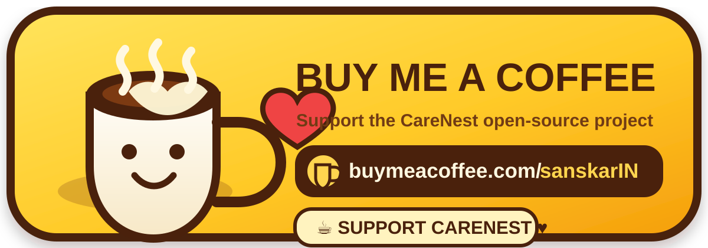

# Support CareNest

  

<strong><a href="https://buymeacoffee.com/sanskarIN">☕ Buy Me a Coffee — support CareNest</a></strong>

CareNest is open source under Apache-2.0. Financial support through Buy Me a Coffee is completely voluntary and is used only as a way to support continued project development and maintenance.

Supporting the project does **not** unlock app features, change reminder behavior, provide medical advice, create a CareNest account, transmit health records to CareNest, or create any entitlement to diagnosis, treatment, emergency support, or priority medical service.

Opening the link leaves the CareNest/GitHub environment and uses a third-party website governed by that site's own terms and privacy practices. Do not include private health information in payment notes, messages, or other third-party fields.

## Official project links

- CareNest repository: https://github.com/sanskarIN/CareNest
- Creator: https://www.github.com/sanskarIN
- Buy Me a Coffee: https://buymeacoffee.com/sanskarIN
- Business: `sanskarin@outlook.in`
- Support: `supportramsandesh@gmail.com`

The badge in this repository is custom CareNest project-support artwork and is not represented as an official Buy Me a Coffee brand asset.
